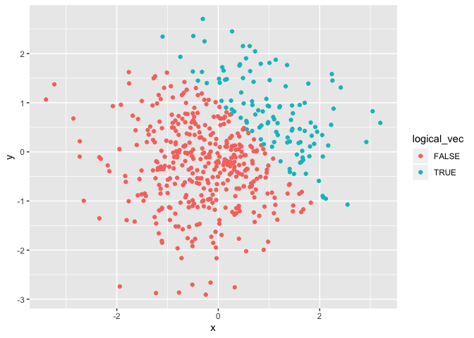
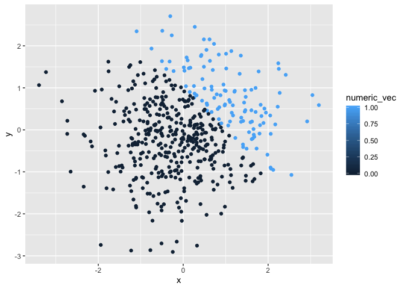
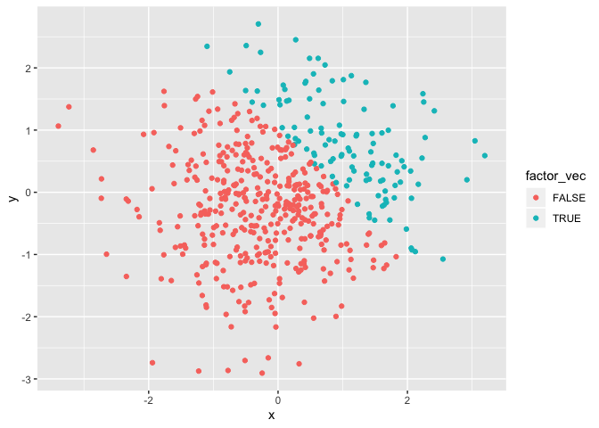

p8105\_hw1\_bg2645
================
Bing Bing Guo
9/18/2019

``` r
##create dataframe containing 4 variables# 

hw1_df = tibble(
  norm_samp = rnorm(8),
  vec_logical = norm_samp > 0,
  vec_char = c("apple", "banana","kiwi", "orange", "peach", "cherry", "lime", "lemon"),
  vec_factor = factor(c("one", "one", "two", "two","two", "three", "three", "three"))
)

##take the mean of each variable in the dataframe#
mean(pull(hw1_df, norm_samp))
mean(pull(hw1_df, vec_logical))
mean(pull(hw1_df, vec_char))
mean(pull(hw1_df, vec_factor))

##you are able to take the mean for norm_samp and vec_logical, however you are unable to take the mean for vec_char and vec_factor# 


as.numeric(pull(hw1_df, vec_logical))
as.numeric(pull(hw1_df, vec_char))
as.numeric(pull(hw1_df, vec_factor))
##you cannot convert characters into numeric, which is why the the character variable resulted in "NA" conversion and thus you cannot take the mean. However, for the logical and factor variables it was able to convert into numeric values. For the logical variable it was able to convert True into 1 and False into 0, and converted the different factor levels into numbers ("one" converted to 1, "two" converted to 3, "three" converted to 2) and thus you are now able to take the mean. 


as.numeric(pull(hw1_df, vec_logical))*(pull(hw1_df, norm_samp))

as.factor(pull(hw1_df, vec_logical))*(pull(hw1_df, norm_samp))
  
as.numeric(as.factor(pull(hw1_df, vec_logical)))*(pull(hw1_df, norm_samp))       
```

Problem 2

``` r
# create dataframe #
set.seed(1234)

plot_df = tibble(
  x = rnorm(500),
  y = rnorm(500),
  logical_vec = x + y > 1,
  numeric_vec = as.numeric(logical_vec), 
  factor_vec = as.factor(logical_vec)
)
```

*There were 500 observations 500 and 5 variables 5 in the dataset *The
mean of the sample is 0.0018388 *The median of the sample is -0.0207073
*The standard deviation of the sample is 1.0348139 \*The proportion of
cases for which x+y\>1 is 0.232

\*NOTE: When knitting, due to error because of multiplication of numeric
to a factor that occured above, an error in the R Markdown occurs at
line 64.

``` r
##create a scatter plot of y vs x, color logical variable # 

ggplot(plot_df, aes(y = y, x = x, color=logical_vec)) + geom_point()
```

<!-- -->

``` r
ggsave("scatterplot1.pdf", plot = last_plot(), height = 4, width = 6)

#create a scatter plot of y vs x, color numeric variable# 
ggplot(plot_df, aes(y = y, x = x, color=numeric_vec)) + geom_point()
```

<!-- -->

``` r
#create a scatter plot of y vs x, color factor variable# 
ggplot(plot_df, aes(y = y, x = x, color=factor_vec)) + geom_point()
```

<!-- -->
