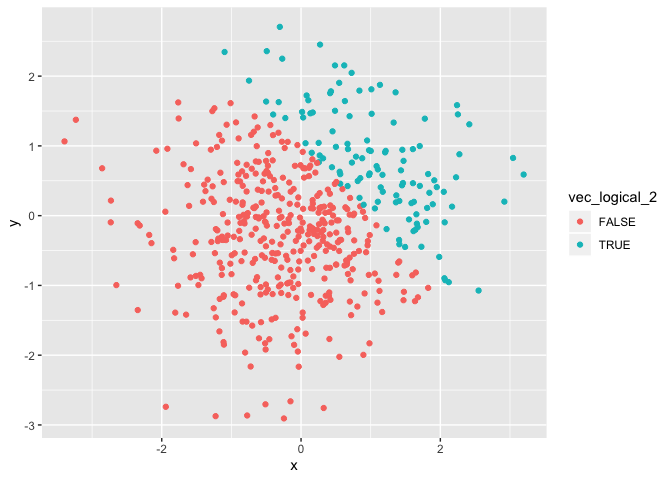
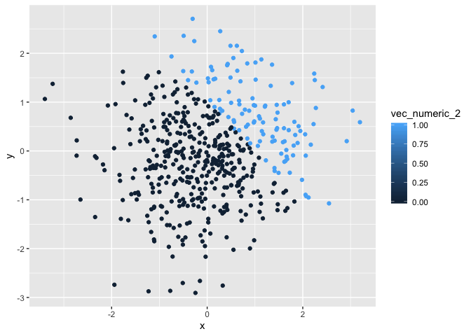
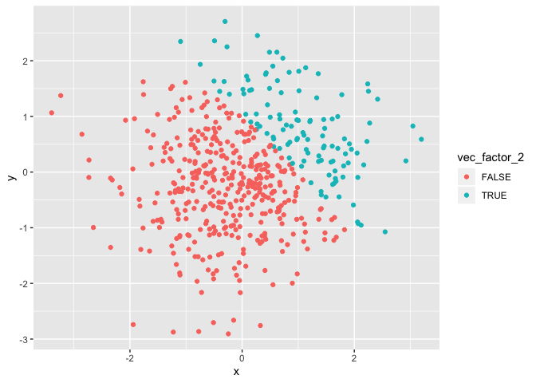

p8105\_hw1\_bg2645
================
Bing Bing Guo
9/18/2019

## Problem 1

**chunk 1**

``` r
#create dataframe containing 4 variables# 

hw1_df = tibble(
  norm_samp = rnorm(8),
  vec_logical = norm_samp > 0,
  vec_char = c("apple", "banana","kiwi", "orange", "peach", "cherry", "lime", "lemon"),
  vec_factor = factor(c("one", "one", "two", "two","two", "three", "three", "three"))
)

#take the mean of each variable in the dataframe#
mean(pull(hw1_df, norm_samp))
```

    ## [1] -0.1453512

``` r
mean(pull(hw1_df, vec_logical))
```

    ## [1] 0.625

``` r
mean(pull(hw1_df, vec_char))
```

    ## Warning in mean.default(pull(hw1_df, vec_char)): argument is not numeric or
    ## logical: returning NA

    ## [1] NA

``` r
mean(pull(hw1_df, vec_factor))
```

    ## Warning in mean.default(pull(hw1_df, vec_factor)): argument is not numeric
    ## or logical: returning NA

    ## [1] NA

  - You are able to take the mean for norm\_samp and vec\_logical,
    however you are unable to take the mean for vec\_char and
    vec\_factor, as the values are “NA”

<!-- end list -->

``` r
as.numeric(pull(hw1_df, vec_logical))
as.numeric(pull(hw1_df, vec_char))
as.numeric(pull(hw1_df, vec_factor))
```

  - You cannot convert characters into numeric, which is why the the
    character variable resulted in “NA” conversion and thus you cannot
    take the mean. However, for the logical and factor variables it was
    able to convert into numeric values. For the logical variable it was
    able to convert True into 1 and False into 0, and converted the
    different factor levels into numbers (“one” converted to 1, “two”
    converted to 3, “three” converted to 2) and thus you are now able to
    take the mean.

**chunk
    2**

``` r
as.numeric(pull(hw1_df, vec_logical))*(pull(hw1_df, norm_samp))
```

    ## [1] 0.00000000 1.20096004 0.07876222 0.00000000 1.20440772 0.09988456
    ## [7] 0.00000000 0.52559890

``` r
as.factor(pull(hw1_df, vec_logical))*(pull(hw1_df, norm_samp))
```

    ## Warning in Ops.factor(as.factor(pull(hw1_df, vec_logical)), (pull(hw1_df, :
    ## '*' not meaningful for factors

    ## [1] NA NA NA NA NA NA NA NA

``` r
as.numeric(as.factor(pull(hw1_df, vec_logical)))*(pull(hw1_df, norm_samp))  
```

    ## [1] -1.1158479  2.4019201  0.1575244 -1.1233104  2.4088154  0.1997691
    ## [7] -2.0332644  1.0511978

## Problem 2

``` r
# create dataframe #
set.seed(1234)

plot_df = tibble(
  x = rnorm(500),
  y = rnorm(500),
  vec_logical_2 = x + y > 1,
  vec_numeric_2 = as.numeric(vec_logical_2), 
  vec_factor_2 = as.factor(vec_logical_2)
)
```

  - There were 500 and 5 in the dataset
  - The mean of the sample is 0.0018388
  - The median of the sample is -0.0207073
  - The standard deviation of the sample is 1.0348139
  - The proportion of cases for which x+y\>1 is 0.232

<!-- end list -->

``` r
#create a scatter plot of y vs x, color logical variable # 

ggplot(plot_df, aes(y = y, x = x, color=vec_logical_2)) + geom_point()
```

<!-- -->

``` r
ggsave("scatterplot1.pdf", plot = last_plot(), height = 4, width = 6)

#create a scatter plot of y vs x, color numeric variable# 
ggplot(plot_df, aes(y = y, x = x, color=vec_numeric_2)) + geom_point()
```

<!-- -->

``` r
#create a scatter plot of y vs x, color factor variable# 
ggplot(plot_df, aes(y = y, x = x, color=vec_factor_2)) + geom_point()
```

<!-- -->

  - Plot 1 and plot 3 have the same color scales as they are both
    coloring binary True or False values, however plot 2 has a different
    color scale as it is now coloring a numeric variable and thus
    coloring based on 0 or 1, however they are still binary values which
    is why there are only two colors shown. This is becasue the numeric
    variable was created by coercing the logical vector, thus turning
    the Yes and No into 0 and 1, respectively. Plot 3 has the same color
    scales as plot 1, since the factor vector was created by coercing
    the logical vector and thus for both variables the values are still
    in True/False.
